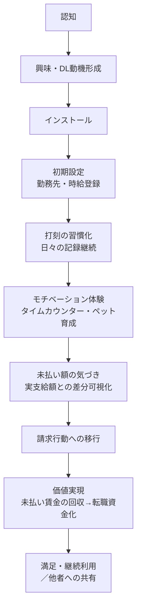

# イキガイ 事業構想

## 1. 解決したい社会課題

現代の日本では「やりがい搾取」や無言の強制によって、サービス残業・過労が常態化している。
本質的な問題は「賃金が正式に支払われていない」ことにある。それが原因で心を病み、退職を余儀なくされる人が生まれている。

### なぜ「賃金未払い」が根本原因なのか

「過労」自体が問題なのではなく、「過労に対する正当な対価がない」ことが、会社の暴走を止める力と、個人が休むための余力を同時に奪っている。

- **会社側**：残業させることに歯止めをかけるのは「残業代を払うコスト」しかない。それが無給なら、会社にとって残業させることに金銭的な痛みが一切なく、過労を抑制する力が構造的に存在しなくなる
- **個人側**：単に疲れているだけでなく「正当な対価を受け取れていないまま働き続けている」という状態が、努力を踏みつけにされている感覚・使い捨てられている感覚を生み、これが心を病ませる大きな要因になる
- **退職後**：対価を受け取っていないから貯金がなく、これがそのまま「準備期間なしで転職」に直結する

さらにこれは単発の問題ではなく、**負のサイクル**を生み出している。

```
過労で心を病み退職
  ↓
未払いのため貯金がなく、心の余裕もない
  ↓
準備期間なしで転職活動 → すぐ就ける仕事に就く
  ↓
「すぐ就ける仕事」＝ブラック企業である可能性が高い
  ↓
同じことが再発する
```

## 2. アイデアの出発点と検証プロセス

最初の発想は「未払い賃金を請求できるサービス」だった。会社に強制された偽の記録ではなく、実態の勤怠記録をつけて退職時に請求し、転職活動の生活費に充ててもらう、というもの。

しかし壁に当たった。**「どうやって記録をつけてもらうか」** ―― 離職を考え始めてから記録をつけても遅い。

そこで発想を転換し、まず「モチベーションアプリ」として日常的に使ってもらう方向に移行した。

- 「今日あと何時間で、ここまでいくら稼いだか」を可視化 → モチベーションになり、楽しい
- アプリ内にバーチャルペットを実装し、働いた時間に応じて餌や服を購入できる → 精神的な生きがい・セーフティネットになる
- 実際に支払われた額を入力すると未払い額を試算できる → 「こんなに貰えていないのか」と実感してもらう
- 最終的に、その記録を使って未払い賃金を請求できる

## 2.5. 情報開示の方針（表と裏の温度差への対応）

「かわいい・楽しいモチベアプリ」として使ってもらいながら、裏側では裁判・労基署で使える証拠を積んでいる ―― という設計は、後出しにするとユーザーの信頼を損なうリスクが高い。

**方針：最初からアプリの説明・オンボーディングに「この記録は証拠にもなる」ことを薄く明記する。**

- 完全に伏せて後出しにする案は不採用。ある日「これ証拠として使えます」と言われて態度を変えられるより、最初から知っていて使う方が信頼を損なわない。
- ただし前面に出しすぎると「未払い請求ツール」感が強くなり、B（興味・DL動機形成）での離脱要因になる（[6. 認知〜価値創出までのファネルと課題](#6-認知価値創出までのファネルと課題)参照）。
- そのため「メインはモチベ・ペット育成、記録は将来もし必要になったときの備えにもなる」という順序でストア説明・オンボーディングに軽く触れる程度の温度感にする。

### 気づいてもらうタイミングの解決策：36協定超過・過労死ライン通知

日々の勤怠記録から、残業時間が36協定の上限や過労死ラインに近づいた・超えたタイミングで危険を通知する機能を用意する。

- 伝え方を「証拠になる」ではなく「あなたの健康が危険」という切り口にすることで、重くならずに自然に核心（この記録は自分を守るためのもの）に気づいてもらえる
- 後出しでも前面に出しすぎでもなく、記録が実際に自分の身を守る場面で初めて意味を実感してもらえる、タイミングとして自然な設計になる
- 具体的な閾値・通知文言・UI設計は別途検討が必要（TODO）

## 3. 提供価値とソリューション

| 項目 | 内容 |
|---|---|
| コア価値 | 未払い賃金（埋没資産）を可視化・請求し、余裕のある転職活動を支える |
| UX（表の顔） | 出勤中の「あと何時間でいくら稼げるか」を可視化するタイムカウンター＋バーチャルペット育成によるゲーミフィケーション |
| システム（裏の顔） | GPS・タイムスタンプ等の複数ログを自動で暗号化保存し、裁判・労基署で通用する「客観的な証拠」を裏側で積み上げる |

## 4. マネタイズ設計（検討案）

初期フェーズは個人開発で、収益化よりも**ユーザーとデータ（証拠）の獲得**を最優先とする。

スケール後は弁護士法（非弁行為の禁止）をクリアしたリーガルテックモデルを想定。

- **案A**：裁判にそのまま使えるデータ出力管理画面（SaaS）を、弁護士へ月額固定のシステム利用料として提供
- **案B**：ユーザーが「公式PDFレポート（打刻証明書）」をダウンロードする際の一時課金
- **案C**：労働問題に強い弁護士をアプリ内に掲載する広告費（掲載料）モデル

## 5. アプリ名候補

「イキガイ」は「キチガイ」と字面が似て見た目が悪いという懸念があり、以下を候補として検討中。

- **Ikigai**（生きがい、ローマ字表記）
- **Boram**（韓国語「보람」＝やりがい・張り合い、由来）

## 6. 認知〜価値創出までのファネルと課題



| # | ステージ | 課題 |
| --- | --- | --- |
| A | 認知 | ターゲット層（サービス残業に悩む人）は検索行動を起こしにくい／届けたい媒体とリーチが薄い |
| B | 興味・DL動機形成 | 「未払い請求ツール」感が強いと、会社に知られる不安からインストールを躊躇される |
| C | インストール | ストア説明・アイコンの見え方次第で信頼感が左右される（案名の字面問題もここに影響） |
| D | 初期設定 | 時給・勤務先・シフトの入力が面倒で、設定完了前に離脱しやすい |
| E | 打刻の習慣化 | 打刻を忘れる／GPS権限を拒否される／iOSのバックグラウンド動作制約で自動打刻が不安定になる |
| F | モチベーション体験 | ゲーミフィケーション（ペット育成等）が薄いと日常利用として定着しない |
| G | 未払い額の気づき | 実際の支給額を手入力する手間・信頼性（給与システムとの自動連携がない） |
| H | 請求行動への移行 | 証拠としての法的有効性への不安、会社と対峙する心理的ハードル、弁護士へのアクセス手段がない |
| I | 価値実現 | 実際に回収できるかの成功率、回収までの時間、非弁行為規制との整合 |
| J | 継続利用・共有 | 会社との対立を伴うネガティブな話題のため、ポジティブなシェア（口コミ）が起きにくい |

## 7. 将来的な連携先（構想）

- リスキリング系の企業・学校
- マイナビ等の転職サービス
- 行政（労基署等）との連携

## 8. 競合調査（2026-07-15 実施）

deep-researchによる調査結果。4カテゴリで既存サービスを確認したが、4要素（GPS証拠記録・弁護士請求支援・給与可視化・ゲーミフィケーション）を統合したアプリは見当たらなかった。

### カテゴリ別の既存サービス

| カテゴリ | サービス例 | 主要機能 | マネタイズ | 弱み・イキガイとの差 |
| --- | --- | --- | --- | --- |
| GPS証拠化系勤怠アプリ | 残業証明アプリ、残業証拠レコーダー（日本リーガルネットワーク） | GPS全自動記録（15分毎等）、過去分保持、未払い額自動算出、弁護士への請求代行ボタン | 請求成功時の成功報酬（完全成功報酬制） | 記録が「証拠を貯める」こと自体が目的で、日常的に使う理由（モチベーション・楽しさ）がない。継続率が課題になりやすい |
| 未払い残業代請求の弁護士サービス | AdIre、リーガルプラス | 無料相談、着手金無料、完全成功報酬制（回収額の22〜33%） | 成功報酬 | 証拠（勤怠記録）がある前提のサービス。記録づくり自体は支援していない |
| 労働組合・個人加盟ユニオン | 総合サポートユニオン、ブラック企業ユニオン、私のユニオン、介護・保育ユニオン | 電話・LINE・メールでの無料相談 | 組合費 | 専用デジタル記録アプリは提供しておらず、既存の証拠（タイムカード等）の提出を求めるのみ |
| 給与可視化・モチベーション系アプリ | TimePay、TimeCarder | 実績時給・給与の自動算出、グラフ表示 | アプリ内課金想定 | ゲーミフィケーション（バーチャルペット等）要素はなく、未払い額試算・請求支援機能もない |

### 市場背景

- 未払い賃金の是正指導は継続的に大規模（厚労省：令和3年度1,069社・65億781万円、2023年度21,349件・101億9,353万円）
- 労基署には支払いを強制する権限がなく、実効性のある解決には弁護士等への相談が必要になるケースが多い

### 市場の空白地帯（イキガイの差別化ポイント）

1. **日常的な継続利用の設計を持つ証拠化アプリが存在しない**：既存の証拠化アプリ（残業証明アプリ等）は「証拠を貯める」ことが目的で、そのままでは使い続けるモチベーションが弱い。イキガイは給与可視化＋バーチャルペット育成で日常利用を先に成立させ、証拠収集を副産物にできる点が独自
2. **給与可視化系アプリはゲーミフィケーション・請求支援と繋がっていない**：TimePay・TimeCarderは可視化のみで終わっており、未払い額試算や弁護士連携への導線がない
3. **労働組合は相談窓口止まりで、デジタル記録ツールを持たない**：組合と組み合わせられる客観的記録データを提供できれば連携の余地がある

### 留意点

- 本調査は限定的なスキャンであり、既存アプリの実利用者数や裁判での証拠採用実績までは確認できていない
- 労働組合が非公開で会員向けツールを持っている可能性は排除できない

## 9. 証拠力に関する法的調査（GPS型 vs タイムスタンプ型）（2026-07-15 実施）

deep-researchによる調査結果。「GPS型とタイムスタンプ型のどちらが証拠として強いか」という単純な優劣ではなく、**組み合わせ方が証拠力を決める**という結論。

### 厚労省ガイドラインの原則

労働時間の確認・記録方法として、厚労省ガイドラインが挙げているのは以下の2方式のみで、GPSは明示的には列挙されていない。

1. 使用者自らの現認
2. タイムカード・ICカード・パソコンの使用時間の記録等の「客観的な記録」

自己申告制（タイムスタンプ的な自己記録に近い方式）は、原則的な方法が使えない場合の**やむを得ない代替手段**という位置づけで、「あいまいな労働時間管理になりがち」なため、実態調査や乖離の補正といった追加の安全策が求められる。

### 裁判例：GPS単独では弱いが、他の客観的記録と組み合わせると強くなる

東京地裁令和6年3月28日判決（T4U事件）が具体的な枠組みを示している。

- GPS記録がオフィス内在所を推認させる場合、**原則としてGPS記録の終了時刻を終業時刻と認定**
- GPSと警備記録（入退館記録）の両方がある場合は、**GPS記録の終了時刻と、警備記録上の退館時刻の2分前とを比べて早い方**を終業時刻とする（鍵を戻し警備をセットする時間を補正）
- GPSの位置誤差（居酒屋等への滞在表示）についても「GPSの誤差の範囲」として証拠の信用性を損なわないと判断
- 一方、**メール送信時刻は社外からも送信可能なため単独では信用性が否定**された

つまりGPSは「その場にいた」証明として、警備記録や社内サーバーの保存記録など**他の客観的記録と矛盾しないこと**によって初めて「相当程度信用できる」と評価される。単独の位置情報だけでは「働いていた」ことの直接証明にはならない、という限界は残る。

### 証拠力の序列（強い順）

1. **タイムカード・勤怠管理システムの記録**：最も認められやすい。「特段の事情がない限り記録どおりに労働した」と事実上推定されやすい
2. **PCログ・GPS・入退館記録などの客観的記録**：単独では限界があるが、複数を組み合わせることで証拠力を補強できる（T4U事件の枠組み）
3. **自己申告制（タイムスタンプ型の自己記録）**：代替的・補完的な手段。他の客観的データとの著しい乖離があれば実態調査・補正が必要になる
4. **メール送信時刻**：社外から送信可能なため単独では証拠力が低いとされた判例がある

### 組み合わせられる記録の追加候補

「複数ログの整合性」を高めるため、GPS・打刻に加えて以下も候補になる。

- **業務エリアの写真**：出退勤時にその場で撮影（EXIFの撮影時刻・位置情報も残る）。建設業向け勤怠アプリで「GPS＋写真」の組み合わせは既に先行例がある。単独では「事前に撮って後で送った」可能性を否定できず、自己申告に近い弱さを持つため、GPS・Wi-Fiなど他の記録との組み合わせが前提
- **Wi-Fi接続ログ**：勤務先Wi-Fi SSIDへの接続履歴。GPSより精度が高く、フロア単位の在室証明になり得る
- **PCログイン/ログオフ・アプリ利用履歴**：厚労省ガイドラインが原則的方法として明示している「客観的な記録」に該当するため、実装できれば証拠力として最も強いカテゴリに入る

### イキガイの設計への示唆

- タイムスタンプ（打刻）のみでは証拠力は弱い部類に入る。**GPS・打刻・（可能なら）給与システムログなど複数のログを組み合わせて保存する**設計が、既存の裁判実務の評価軸と合っている
- GPSは「単独の決め手」ではなく「他の記録と矛盾しないことを示す補強材料」として位置づけるべき。マーケティング的にも「GPSがあれば証拠になる」と単純化せず、「複数ログの整合性」を訴求する方が実務に即している
- 自己申告に近い運用（手動打刻のみ）だと証拠力が弱いカテゴリに入るため、自動打刻・自動GPS記録を既定にする方が証拠としての価値を高められる

### 留意点（証拠力調査）

- ソースの多くは法律事務所の解説ブログ（二次資料）であり、判決文原文には直接アクセスしていない
- GPSの法的性質論（「その場にいた」と「労働していた」の区別）は理論的な整理としては検証時に票が割れ、T4U事件という個別判例の事実認定の範囲でのみ確認できた。一般法理として断定はできない
- 厚労省ガイドラインには複数版（現行版と旧版と見られるもの）が混在しており、細部の記載に差がある可能性がある

### 自動打刻トリガーの実装状況（2026-07-17、GPSジオフェンスに変更）

Wi-Fi SSIDトリガー（フォアグラウンド限定）はMVPとして一度実装したが、「アプリを閉じていても常時発火させる」ことを必須要件としたため、**GPSジオフェンスに切り替えた**。

- Wi-Fi単体でのバックグラウンド常時監視はOSの制約上ほぼ不可能（iOSに一般アプリ向けの公開APIがなく、Androidも8以降バックグラウンドの接続変化通知が制限されている）
- 一方GPSジオフェンス（`CLLocationManager`のregion monitoring／Androidの`GeofencingClient`）は、**アプリがバックグラウンド／terminated状態でもOSが直接アプリを起こして通知してくれる**、正式にサポートされた仕組み
- 実装は`native_geofence`パッケージを使用。`lib/src/services/geofence_clock_trigger_service.dart`の`handleGeofenceEvent`がOSから直接呼ばれる背景アイソレート上のコールバックで、Riverpodのウィジェットツリーを経由せずFirebaseを再初期化してFirestoreに直接出退勤を記録する
- `Workplace`モデルに`autoClockInLatitude`/`autoClockInLongitude`を追加（旧`autoClockInSsid`は廃止）。`workplace_form.dart`から現在地をワンタップで登録できる
- 位置情報は「常に許可（Always）」が必要 ―― iOS/Androidどちらも、アプリを閉じていてもジオフェンスイベントを受け取るための必須要件
- ジオフェンスの半径は150m固定（GPSのドリフトを吸収するための余裕）

### 残っている作業（実機・手動対応が必要）

- **iOS**: `ios/Podfile`が未生成の状態のため、Xcodeで一度ビルド（またはpod install）してPodfileを生成し、`platform :ios, '14.0'`以上に設定する必要がある
- 実機（物理デバイス）でのジオフェンス動作確認は未実施。シミュレータはジオフェンスイベントが正しく発火しないことが多いため、実機でのテストが必須
- Android実機テストも未実施。特にAndroid 10+の「バックグラウンドの位置情報」許可は、OSの設定画面から手動で「常に許可」に変更する追加ステップが必要になる場合がある
- App Store/Google Play審査でバックグラウンド位置情報の使用理由を説明する審査ノートの準備が必要（「勤務先に着いたら自動で出退勤を記録するため」等）

## 10. 原文メモ（要約前の元テキスト）

上記セクションは以下の原文を要約・構造化したもの。ニュアンスの欠落を防ぐため原文もそのまま残す。

> 私が考えているサービスは「イキガイ」（仮称）というサービスです。
> このサービスを通して、私は「サービス残業が生み出している負のサイクル」を解消したいと考えています。
>
> 現代の日本では、やりがい搾取や無言の強制によって
> サービス残業、過労が常態化しています。
> それ自体も当然問題ですが、一番問題なのは「賃金が正式に支払われていない」という点です。
> それにより心を病んでしまったり、会社を辞めざるを得ない人たちがいます。
>
> さらに先述した通り、これは単なる問題ではなく負のサイクルを生み出す元凶です。
> 過労などで心を病んで退職しても、正式に支払われていない状態では貯金もなく、心の余裕もないため準備期間がほとんどないままに
> 転職活動を行い、すぐに就ける仕事に就く。
> しかし、残念ながらすぐに入れる仕事＝ブラック企業である可能性が極めて高く、同じようなことがまた起きてしまう。
>
> こんなサイクルを変えるために私が考えたのは
> 「未払い賃金を請求できるサービス」です。
> 会社に強要された偽の記録ではなく、実態の勤怠記録をつけ、退職時に請求を行い、
> それを生活費として余裕を持って転職活動をしてもらう。
> これがアイデアの始まりでした。
>
> しかし、最初に壁にぶち当たりました。
> 「どうやって記録をつけてもらおう」
> 離職を考え始めてからつけても遅い。
>
> そこで、まずは「モチベアプリ」に移行しました
> その日あと何時間あって、自分はいくら稼いだのかを可視化できれば
> モチベーションになりますし何より楽しいのでは
> そう考えました。
>
> さらに、アプリ内にバーチャルペットを実装し、働いた時間に応じて餌や服などを買えれば
> 生きがいになり精神的にも崩れずにいれるのではないかと。
>
> その上で実際に支払われた額を入力すると、未払い額を試算することができ、
> あれ、こんなに貰えていないのか。と実感してもらう。
> 最終的にはその記録を使って請求できる。
> これがいい。と考えています。
>
> 最終的にはリスキリング系の会社や学校、マイナビなどの転職サービスとの連携や
> 行政との連携も視野に入れています。

### 事業計画サマリー：「イキガイ（仮称）」

1. 解決したい社会課題（ペイン）
   現状：サービス残業や過労の常態化、および「賃金の未払い」。
   負のサイクル：過労で退職 ➔ 貯金と心の余裕がない ➔ 準備期間なしで転職 ➔ 再びブラック企業へ入社。
2. 提供価値とソリューション（製品）
   コア価値：未払い賃金（埋没資産）を可視化・請求し、余裕のある転職活動を支える。
   UX（表の顔）：出勤中の「あと何時間でいくら稼げるか」を可視化するタイムカウンターと、バーチャルペット育成による精神的セーフティネット（ゲーミフィケーション）。
   システム（裏の顔）：GPSやタイムスタンプなどの複数ログを自動で暗号化保存し、裁判や労基署で勝てる「客観的な証拠」を裏側で完璧に積み上げる。
3. マネタイズ設計（検討案）
   初期は個人開発でユーザーとデータ（証拠）の獲得を最優先とする。スケール後の収益化は以下の弁護士法（非弁行為の禁止）をクリアしたリーガルテックモデルを採用。
   案A：裁判にそのまま使えるデータ出力管理画面（SaaS）を、弁護士へ月額固定のシステム利用料として提供。
   案B：ユーザーが「公式PDFレポート（打刻証明書）」をダウンロードする際の一時課金。
   案C：労働問題に強い弁護士をアプリ内に掲載する、広告費（掲載料）モデル。

### 7/15そわっちMTGメモ

- 犬のデザイン、話しかけてくるデザイン、親しみやすさ
- 健康管理
- なりたい姿とは？
- ミニマムでスタートなら犬の要素は省いていく
- ユーザーヒアリングを行いつつ向上させる
- 編集時にメモ,必須ではないが残した方が証拠として有利？,選択式でもいいけど
- mixi2,3~5年開発かけてからリリース
